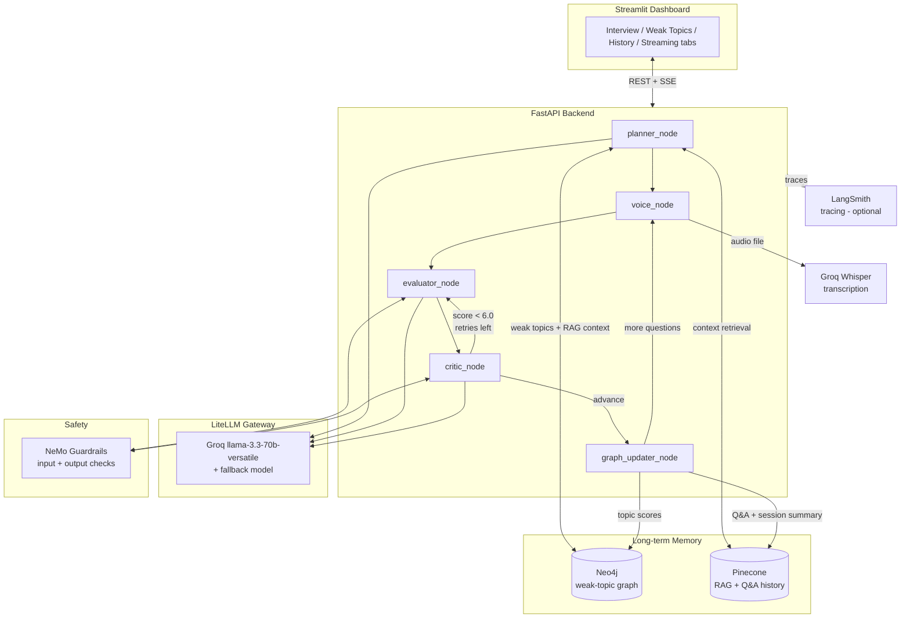

# CogniCoach 🧠

An adaptive AI interview coach that asks you real technical questions,
scores your answers on depth/accuracy/communication, follows up when
you're vague, and remembers your weak spots across sessions — built
as a multi-agent LangGraph system with long-term memory, real-time
voice input, and safety guardrails.

> Runs entirely locally — no live demo link. Clone it, add your own
> free-tier API keys, and run it on your machine (see **Setup** below).

---

## Why this project

Most "chat with an LLM" projects are a single prompt in a loop. This
one isn't:

- **A real agent loop, not a chatbot** — a LangGraph state machine
  (`planner → voice → evaluator → critic → graph_updater`) that
  pauses for human input mid-graph and resumes from a checkpoint.
- **Actual long-term memory** — a Neo4j knowledge graph tracks which
  topics you're weak in *across sessions*, and Pinecone stores every
  past Q&A so the planner can reference specific things you said
  weeks ago.
- **Adaptive, not scripted** — the critic node decides in real time
  whether your answer earned a follow-up, and generates a genuinely
  narrower question targeting exactly what you got wrong.
- **Real voice input** — Groq Whisper transcription, not a mocked
  feature.
- **Actual safety guardrails** — NeMo Guardrails checks every answer
  before it's scored and every piece of generated feedback before
  it's shown.

## Architecture



**Why a checkpointed graph instead of a simple request/response
loop:** the interview needs to *pause* after each question — waiting
on a human, potentially for minutes — then resume exactly where it
left off, including all prior scoring and retry state. LangGraph's
`MemorySaver` checkpointer plus `interrupt_before=["voice"]` gives
that for free; a plain FastAPI endpoint would need to hand-roll
session state itself.

## Tech stack

| Layer | Technology | Why |
|---|---|---|
| Agent orchestration | **LangGraph** | Stateful, checkpointed, resumable multi-node graph — not just a prompt chain |
| LLM | **Groq** (`llama-3.3-70b-versatile`) | Fast inference, generous free tier, OpenAI-compatible API |
| LLM gateway | **LiteLLM** | One proxy in front of primary/fallback/evaluator model aliases — single point of failover |
| Voice | **Groq Whisper** (`whisper-large-v3-turbo`) | Real transcription, not mocked |
| Knowledge graph | **Neo4j** | Per-user weak-topic tracking across sessions — a graph fits this relationship better than rows in a table |
| Vector memory | **Pinecone** + local `sentence-transformers` | RAG context for the planner, full Q&A transcript storage, no OpenAI dependency for embeddings |
| Safety | **NeMo Guardrails** | Input/output checks on every answer and every generated question |
| Backend | **FastAPI** | Async, typed, auto-documented (`/docs`) |
| Frontend | **Streamlit** | Dashboard shipped in one language, one process — no separate JS build pipeline |
| Observability | **LangSmith** (optional) | Full trace of every node call, every LLM call, every retry |

## Features

- 5-question adaptive interview sessions, personalised to your
  weakest tracked topics
- Real-time scoring across 3 dimensions (depth, accuracy,
  communication) plus an overall score
- Automatic follow-up questions when an answer is weak, capped at 2
  retries so it never loops forever
- Type or speak your answers (real Groq Whisper transcription)
- Weak-topics dashboard — bar chart of what to study next
- Full session history with score trends over time and per-session
  transcripts
- Optional streaming ("typewriter") feedback delivery
- Input/output safety guardrails on every LLM-generated interaction
- Long-term memory — the planner references your actual past answers
  when generating new questions

## Project structure

```
cognicoach/
├── backend/
│   ├── api/
│   │   ├── main.py                  # FastAPI app — the 5-node graph
│   │   ├── weak_topics_router.py    # GET /user/{id}/topics
│   │   ├── history_router.py        # GET /user/{id}/sessions[/qa]
│   │   └── streaming_router.py      # POST /session/answer/stream (SSE)
│   ├── memory/
│   │   ├── neo4j_client.py
│   │   └── pinecone_client.py
│   ├── safety/
│   │   ├── guardrails_client.py
│   │   └── config.yml
│   └── voice/
│       └── voice_client.py
├── frontend_streamlit/
│   └── app.py
├── test_integration.py    # end-to-end happy-path test against your live stack
├── test_edge_cases.py      # adversarial testing (edge cases, retry-guard stress test)
├── litellm_config.yaml
├── requirements.txt
├── .env.template
├── BUGFIXES.md              # every integration bug found + fixed during development
├── RESUME_BULLETS.md        # resume / portfolio copy, interview talking points
└── DEMO_SCRIPT.md           # ~2-minute walkthrough script for a demo recording
```

## Testing

Two test scripts are included, meant to be run against your own live
stack (not mocks):

```bash
# with litellm + uvicorn already running (see Run it, below)
pip install requests   # if not already installed via requirements.txt
python test_integration.py   # happy-path: full session, guardrails, dashboards, streaming, voice
python test_edge_cases.py     # adversarial: empty/long/non-English/garbage input, retry-guard stress test
```

Both print a ✅/❌ report and exit non-zero on any failure. See
`BUGFIXES.md` for the real bugs these scripts already caught and fixed
during development.

## Setup


### Prerequisites (all free tier)

- [Groq API key](https://console.groq.com/keys)
- [Neo4j AuraDB free instance](https://neo4j.com/cloud/aura-free/)
- [Pinecone API key](https://www.pinecone.io)

### Install

```bash
git clone <this-repo>
cd cognicoach

python -m venv venv
source venv/bin/activate        # Windows: venv\Scripts\activate
pip install -r requirements.txt
cp .env.template .env           # fill in your 3 API keys

cd frontend_streamlit
pip install -r requirements.txt
cp .env.template .env           # default localhost URL is correct
cd ..
```

### Run (3 terminals)

```bash
# Terminal 1 — LLM gateway
litellm --config litellm_config.yaml --port 4000

# Terminal 2 — backend
uvicorn backend.api.main:app --reload --port 8000

# Terminal 3 — frontend
cd frontend_streamlit && streamlit run app.py
```

Open `http://localhost:8501`.

## Screenshots

<!--
  Add screenshots here after running the app locally:
    - Interview tab mid-session (question + rubric)
    - Weak Topics dashboard
    - History / score trend chart
    - A LangSmith trace (if tracing is enabled)
  Markdown syntax once you have the images in a /screenshots folder:
    
-->

*Screenshots to be added — see `Day 25` for the demo walkthrough this
will be captured from.*

## Known limitations / honest notes

- **"Streaming feedback" is a typewriter effect, not token-level
  model streaming.** The evaluator uses structured output
  (`with_structured_output`), which returns one parsed object, not a
  token stream — the full rubric is computed first, then the
  feedback text is streamed to the UI word-by-word. See
  `backend/api/streaming_router.py`'s docstring for the true-streaming
  upgrade path.
- **No live deployment.** This project intentionally runs local-only
  — Docker/cloud deployment was scoped out. Everything above is
  written for a local clone-and-run workflow.
- **Guardrails add latency.** Every answer now runs through an input
  check before scoring and an output check after — noticeably slower
  than the un-guarded version, which is the expected safety/speed
  trade-off.
- **The evaluator prompt is English-tuned.** Non-English answers
  don't crash anything (verified — see `BUGFIXES.md`), but scoring
  fairness across languages isn't something this project claims to
  handle well.

## Bug fixes and testing

This project went through real end-to-end integration testing
(adversarial input, retry-loop stress testing, invalid session
handling) after every individual piece was already unit-tested in
isolation — and found genuine bugs that no single component's own
tests could have caught (guardrails that existed in code but were
never actually wired into the live API; a Pinecone vector-dimension
mismatch; a swallowed exception hiding real errors behind a wrong
error code). Full details, plus the runnable test scripts
(`test_integration.py`, `test_edge_cases.py`), are in `BUGFIXES.md`.

## License

MIT
